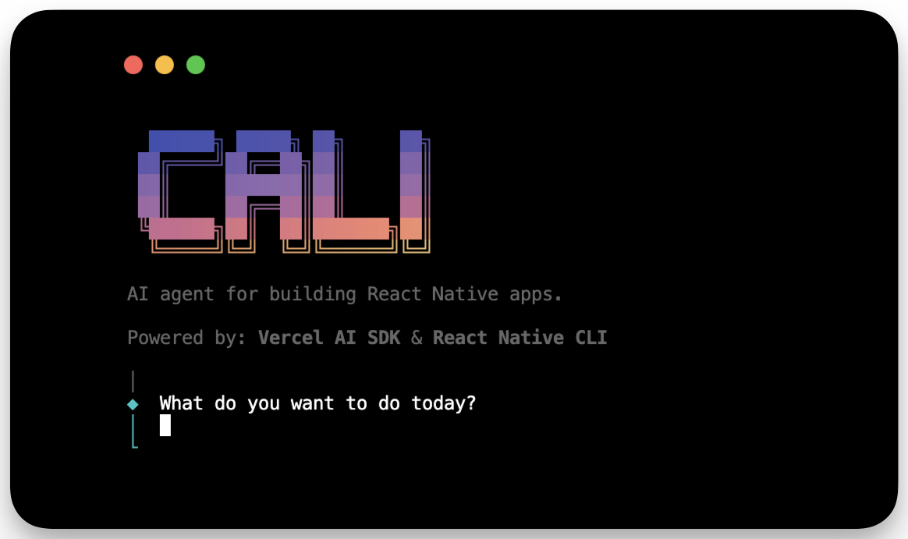

<div align="center">
  <h1>cali</h1>
</div>

<p align="center">
  
</p>

<p align="center">
  🪄 An AI agent for building React Native apps 
</p>

---

```bash
$ npx cali
```

## Wait, what?

Cali is an AI agent that helps you build React Native apps. It takes all the utilities and functions of a React Native CLI and exposes them as tools to an LLM.

Thanks to that, an LLM can help you with your React Native app development, without the need to remember commands, spending time troubleshooting errors, and in the future, much more.

Under the hood, it uses [Vercel AI SDK](https://github.com/ai-sdk/ai), [@react-native-community/cli](https://github.com/react-native-community/cli).

The default model is `gpt-4o`.

> [!NOTE]
> You can change the default model by setting `AI_MODEL` env variable. We are currently
evaluating how different models perform, so we might change the default model in the future.

## Features

Cali is still in the early stages of development, but it already supports:

- **Build Automation**: Running and building React Native apps on iOS and Android
- **Device Management**: Listing and managing connected Android and iOS devices and simulators
- **Dependency Management**: Install and manage npm packages and CocoaPods dependencies.
- **React Native Library Search**: Searching and listing React Native libraries from [React Native Directory](https://reactnative.directory)

as well as various smaller utilities:

- **Port Forwarding**: Use ADB to forward ports for Android devices.
- **Ruby Gems Installation**: Install Ruby gems, including CocoaPods, for iOS projects.
- **Metro Bundler**: Automatically start Metro bundler for React Native projects.

We are actively working on expanding its capabilities. If you would like to request a feature, please open an issue.

## Examples

#### Building an app step-by-step

[TBD]

#### Building an app with a highly-specific task

[TBD]

#### Searching and installing a new React Native library

[TBD]

#### Troubleshooting an error

[TBD]

## Prerequisites

In order to use Cali, you need to have an OpenAI API key. You can get one [here](https://platform.openai.com/api-keys). Once you have your key, you can set it as `OPENAI_API_KEY` env variable (either create a dotenv file or set it inline).

> [!NOTE]
> In the future, you will be able to change the provider from OpenAI to other, including local and self-hosted models. If you are interested in this feature, please open an issue so we can prioritize it and make sure it brings the best DX.

## Usage

Under the hood, Cali uses Vercel AI SDK. That means you can import all its tools into your existing project and use them for different purposes, without our interactive chat interface.

```ts
// import all tools
import { reactNativeTools, androidTools, iosTools } from "cali";

// use them in your project
import { generateText } from "ai";
await generateText({
  // other options
  tools: {
    ...reactNativeTools,
    ...androidTools,
    ...iosTools,
  },
});
```

## Future requests

I like the idea of an AI agent for building React Native apps. I would like to play around with this idea in public, and see where it goes.

Feel free to open an issue or a discussion to suggest ideas or report bugs. Happy to hear from you! 👋

## Contributing

This project uses Bun.

To build the project, run `bun run build`.
To watch for changes and rebuild the project, run `bun run watch`.

To link the project to your global `bun` installation, run `bun link`.

To run the project, run `bun ./src/cli.ts`.
To run the project from global installation, run `bun --bun run cali`.

Note `--bun` is required due to shebang line in the CLI pointing to Node.

## Special thanks

Special thanks to [@jedirandy](https://github.com/jedirandy) for donating the name `cali` on `npm`!
